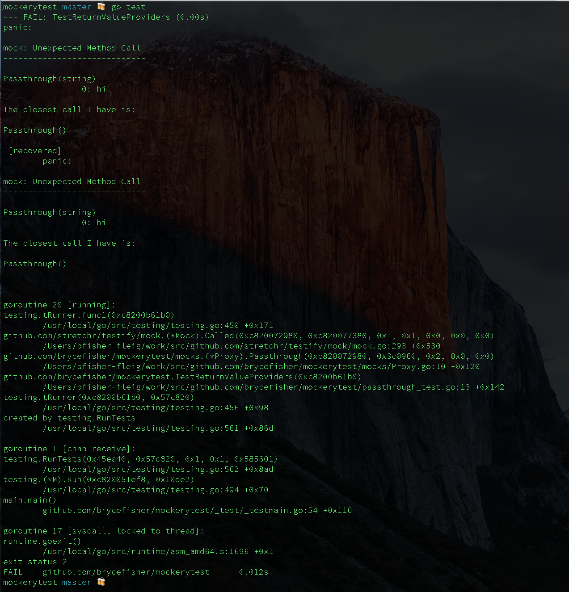

Mockerytest
-----------

Tries to follow the source code taken from the mockery README.

## Setup

```
$ export PATH=$PATH:$GOPATH/bin
$ go get github.com/vektra/mockery/mockery/
$ go get github.com/vektra/mockery/cmd/mockery/
$ go get github.com/stretchr/mock/
$ go get github.com/brycefisher/mockerytest/
```

## Testing

```
cd $GOPATH/src/brycefisher/mockerytest
go test
```

...which gives me this


